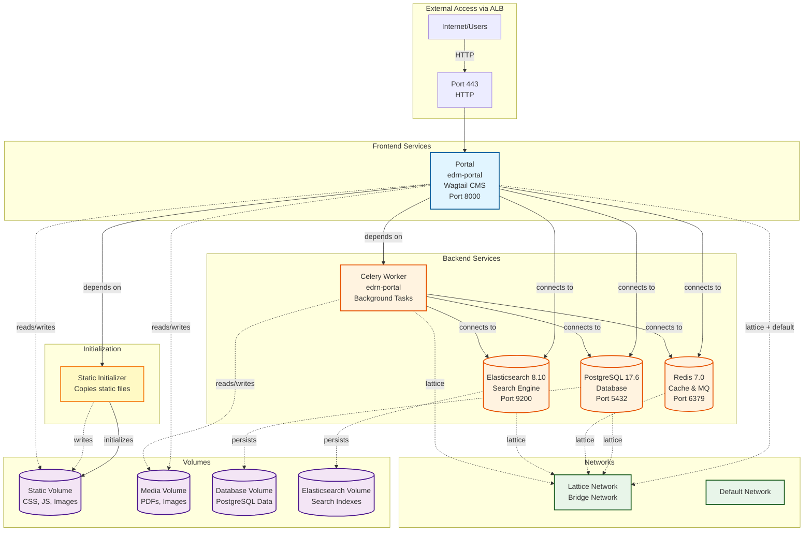

# EDRN Portal Docker Architecture

## Service Details

### Frontend Services
- **Portal**: Main Wagtail CMS application (port 8000, published as 443)

### Backend Services
- **Database**: PostgreSQL 17.6 storing portal content
- **Cache**: Redis 7.0 for caching and message queue
- **Search**: Elasticsearch 8.10 for full-text search
- **Worker**: Celery worker for background task processing

### Volumes
- **Static Volume**: CSS, JavaScript, images (bind mount)
- **Media Volume**: User-uploaded files like PDFs and images (bind mount)
- **Database Volume**: PostgreSQL data persistence (bind mount)
- **Elasticsearch Volume**: Search indexes and data

### Networks
- **Lattice Network**: Internal bridge network for service communication
- **Default Network**: Default Docker network (used by Portal)

## Connection Flow

1. **External → Portal**: Direct HTTP access on port 443
2. **Portal ↔ Backend Services**: Connects to DB, Cache, and Search
3. **Worker ↔ Backend Services**: Processes background tasks using DB and Cache
4. **Static Initializer**: Prepares static files volume before Portal starts

