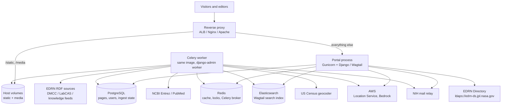
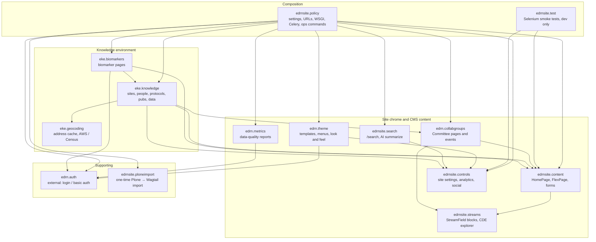
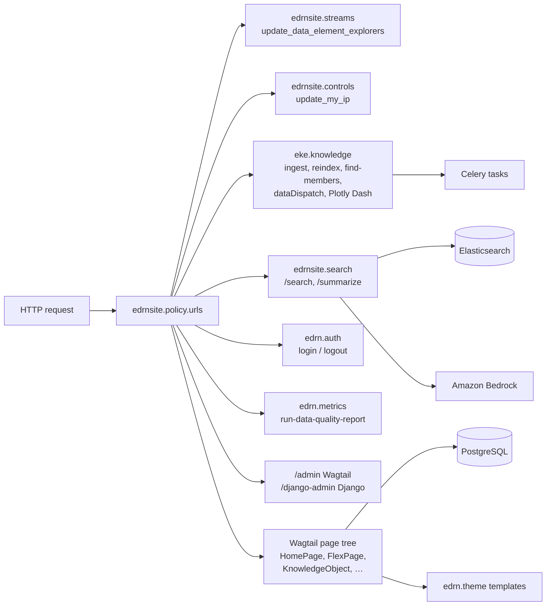
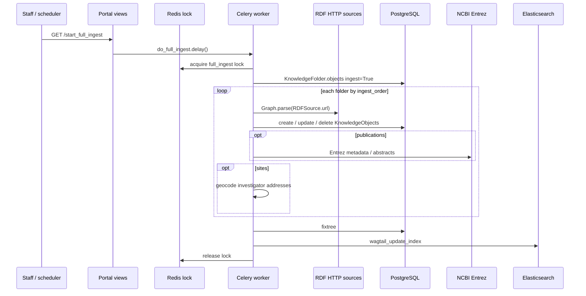
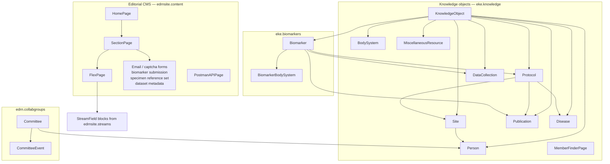

# EDRN Portal Architecture

The Early Detection Research Network (EDRN) public portal is a [Wagtail](https://wagtail.org/) CMS on [Django](https://www.djangoproject.com/). It is the software that nominally runs [edrn.cancer.gov](https://edrn.cancer.gov/). The codebase is a composition of Python packages.

This document is a high-level map of how those packages, services, and external systems fit together. Docker-specific runtime wiring is also covered in [`docker/architecture-diagram.md`](../docker/architecture-diagram.md).

---

## Runtime stack

Visitors hit a reverse proxy (ALB, Nginx, or Apache). That proxy serves static and media files from the host filesystem and forwards everything else to Gunicorn, which runs the Django/Wagtail application. A Celery worker shares the same image and database and handles long-running work (RDF ingest, search reindex, LDAP group sync, email).

`edrnsite.policy.settings.ops` is the production settings module. Local development uses `local.py`, which imports `edrnsite.policy.settings.dev`.

---

## Python packages

`edrnsite.policy` is the composition root: Django settings, root URLConf, WSGI entry, Celery app, and management commands. Everything else is a Django/Wagtail app. `edrn.auth` is an external package (not in this repo) that supplies login views and the `logged_in_or_basicauth` decorator used by staff-only endpoints.

Install order in the root `README.md` (geocoding → streams → controls → content → collabgroups → knowledge → biomarkers → search → theme → ploneimport → metrics → policy → test) follows these dependencies.

---

## Request flow

`edrnsite.policy.urls` concatenates app URL patterns, then Wagtail's page tree. Dedicated Django views sit in front of the catch-all Wagtail page router.

Staff-only operational URLs (`start_full_ingest`, `reindex_all_content`, `sync_ldap_groups`, `fixtree`, and similar) enqueue Celery tasks rather than doing the work in the request.

---

## Knowledge ingest

Knowledge pages are Wagtail pages with RDF subject URIs. Each `KnowledgeFolder` points at one or more `RDFSource` URLs. A full ingest walks enabled folders in `ingest_order`, maps RDF predicates to model fields, then repairs the page tree and rebuilds the search index.

`eke.knowledge.utils.Ingestor` is the base mapper. Folders can substitute a custom ingestor (committees populate `edrn.collabgroups.Committee` rather than a knowledge object). Biomarker ingest lives in `eke.biomarkers` and uses the same RDF folder pattern.

Other Celery tasks:

| Task | Package | Purpose |
|---|---|---|
| `do_full_ingest` | `eke.knowledge` | RDF ingest of all enabled folders |
| `do_reindex` | `eke.knowledge` | Rebuild Wagtail search index |
| `do_fix_tree` | `eke.knowledge` | Wagtail `fixtree` |
| `do_ldap_group_sync` | `eke.knowledge` | Copy LDAP groups into Django |
| `do_update_my_ip` | `edrnsite.controls` | Record the portal's egress IP |
| `do_send_email` | `edrnsite.content` | Delayed form-notification email |

---

## Domain: pages and knowledge

Editorial content and ingested knowledge both live in Wagtail's page tree. Knowledge types share `KnowledgeObject` (an RDF subject URI plus description) and sit under typed index folders.

`@@dataDispatch?subjectURI=…` is a compatibility shim: given an RDF identifier, it redirects to the matching knowledge page.

---

## Configuration and identity

Authentication tries LDAP first (`django_auth_ldap`), then Django's model backend. Wagtail password management is disabled; credentials live in the EDRN Directory. Site-wide knobs are Wagtail settings, not code:

| Setting | App | Role |
|---|---|---|
| `Informatics` | `edrnsite.controls` | Entrez identity, DMCC URL, banner, version override |
| `Search` | `edrnsite.controls` | Pagination plus Bedrock credentials / prompt |
| `RDFIngest` | `eke.knowledge` | Global ingest enable, timeout, protocol ID cutoff |
| `Geocoding` | `eke.geocoding` | AWS Location Service keys |

`edrnsite.test` is not installed in the production image. It is a Firefox/Selenium suite aimed at a running portal (`task e2e`).
