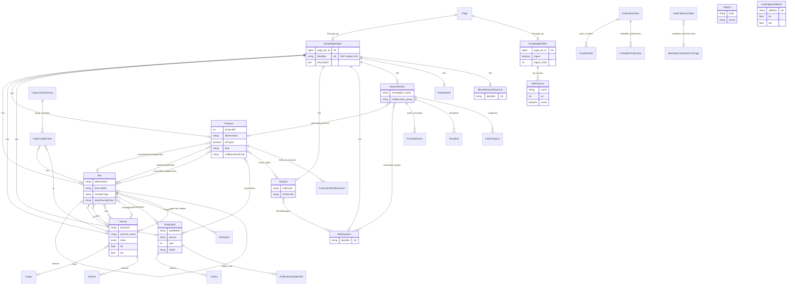
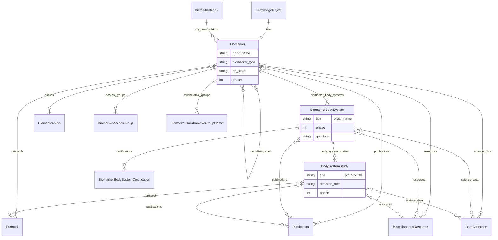

# EDRN Portal entity–relationship diagram

Derived from the Django / Wagtail models in this repository (not from a live database dump). Table names in PostgreSQL follow Django’s default `{app}_{model}` pattern, for example `ekeknowledge_site` and `ekebiomarkers_biomarker`.

Most domain objects are **Wagtail pages**. Multi-table inheritance means `Site`, `Person`, `Protocol`, and the rest each have a one-to-one row that points at `KnowledgeObject`, which in turn points at `wagtailcore_page`. The page *tree* (folder contains object) is Wagtail’s path encoding on `Page`, not a separate foreign key.

Crow’s-foot notation: `||` mandatory one, `o|` optional one, `|{` one or more, `o{` zero or more.

---

## Knowledge core

Sites, people, protocols, publications, diseases, organs, and LabCAS data collections.

`Person` lives under a `Site` in the page tree. `PMCID` and `InvestigatorAddress` are standalone caches (PubMed Central IDs and geocoded addresses). They are not foreign-keyed to `Publication` or `Person`.

Index pages (`SiteIndex`, `ProtocolIndex`, `PublicationIndex`, …) are `KnowledgeFolder` subclasses and are omitted here; each holds RDF sources and child knowledge objects.

---

## Biomarkers

A biomarker may be a single analyte or a panel (`members` to other biomarkers). Organ- and protocol-specific research hangs off `BiomarkerBodySystem` and `BodySystemStudy`. Those two classes also copy the publication / resource / data-collection links from the abstract `ResearchedObject`.

---

## Committees, CMS, CDE, settings

Editorial pages, collaborative groups, common-data-element explorer, metrics snapshots, and Wagtail site settings.

```mermaid
erDiagram
    Page ||--o| HomePage : "ISA"
    Page ||--o| SectionPage : "ISA"
    Page ||--o| FlexPage : "ISA"
    Page ||--o| Committee : "ISA"
    Page ||--o| CommitteeEvent : "ISA"
    Page ||--o| DataQualityReport : "ISA"
    Page ||--o| EmailForm : "ISA"

    Committee }o--o| Person : "chair"
    Committee }o--o{ Person : "co_chairs"
    Committee }o--o{ Person : "members"
    Committee }o--o{ Person : "program_officers"
    Committee }o--o{ Person : "project_scientists"
    Committee ||--o{ CommitteeEvent : "page tree children"
    Committee ||--o{ FlexPage : "documents"

    Committee {
        string id_number
        text description
    }
    CommitteeEvent {
        datetime when
        string timezone
        int duration
        url online_meeting_url
    }

    DataQualityReport }o--o{ Biomarker : "publess_biomarkers"
    DataQualityReport }o--o{ Biomarker : "dataless_biomarkers"
    DataQualityReport }o--o{ DataCollection : "piless_data"
    DataQualityReport }o--o{ DataCollection : "biomarkerless_data"
    DataQualityReport }o--o{ Publication : "piless_pubs"

    WagtailSite ||--|| RDFIngest : "site setting"
    WagtailSite ||--|| Informatics : "site setting"
    WagtailSite ||--|| Search : "site setting"
    WagtailSite ||--|| Geocoding : "site setting"

    RDFIngest {
        boolean enabled
        int timeout
        int edrn_protocol_limit
    }
    Informatics {
        string entrez_id
        url dmcc_url
        string funding_cycle
    }
    Search {
        int results_per_page
        int when_to_enable_ai
    }
    Geocoding {
        string access_key
        string secret_key
    }

    DataElementExplorerObject |o--o{ DataElementExplorerObject : "parent / children"
    DataElementExplorerObject ||--o{ DataElementExplorerAttribute : "attributes"
    DataElementExplorerAttribute ||--o{ DataElementExplorerPermissibleValue : "permissible_values"

    DataElementExplorerObject {
        string name
        string spreadsheet_id
    }
    DataElementExplorerAttribute {
        string text
        string data_type
        boolean inheritance
    }

    CollaborativeGroupSnippet {
        string cg_code UK
        string name UK
    }
    SocialMediaLink {
        string name
        url url
        boolean enabled
    }
    BoilerplateSnippet {
        string bp_code PK
    }
    CertificationSnippet {
        url url PK
    }
    ReferenceSetSnippet {
        string reference_set_code PK
    }
    SpecimenTypeSnippet {
        string specimen_type_code PK
    }
    KnowledgeObjectLogEntry }o--o| KnowledgeObject : "page"
```

Form pages (`BiomarkerSubmissionFormPage`, `SpecimenReferenceSetRequestFormPage`, `DatasetMetadataFormPage`, `MetadataCollectionFormPage`, `CaptchaEmailForm`) are Wagtail pages with no foreign keys into the knowledge graph. Wagtail form submissions are stored in the usual `wagtailforms` tables.

Snippets such as `CollaborativeGroupSnippet` and `SocialMediaLink` are looked up by code or listed globally; they are not FK-linked from Committee or Protocol.
